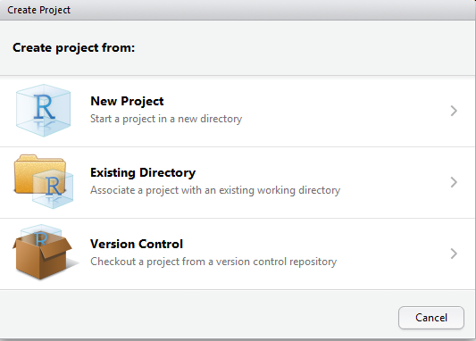

<!-- README.md is generated from README.Rmd. Please edit that file -->

# R Class

This is an empty repo to initialize an R project for class at by
[Columbia Business
School](https://www8.gsb.columbia.edu/courses/mba/2019/fall/b8144-001).

Please **follow all instructions** to set up your environment for the
training.

# Install R and RStudio

This is just like installing any other program.

  - [R](https://cloud.r-project.org/)
  - [RStudio](https://www.rstudio.com/products/rstudio/download/#download)

# Getting the Repo

In order to get the most out of class you have to be working in this
project. There are three ways to get this project on your computer.

Choose **one of these methods**.

1.  Clone the repo using the command line
2.  Clone the repo using the RStudio GUI
3.  Use the [`{usethis}`](https://usethis.r-lib.org) package to download
    and unzip the repo

## Command Line

This assumes you have `git`
[installed](https://git-scm.com/book/en/v2/Getting-Started-Installing-Git).\[1\]

Run this command in the command line or shell.

``` sh
git clone https://github.com/nyhackr/cbs2019fall.git
```

Then open the `cbs2019fall.Rproj` file.

## RStudio Gui

This assumes you have `git`
[installed](https://git-scm.com/book/en/v2/Getting-Started-Installing-Git).

Click `File > New Project`.

<!-- -->

Click `Version Control`.

<!-- -->

Click `Git`.

<!-- -->

Choose a folder in the `Create project as a subdirectory of` field.

Paste `https://github.com/nyhackr/cbs2019fall`\[2\] in the `Repository
URL` field.

<!-- -->

## `usethis` Package

Run these commands in the R console.

``` r
# install usethis package
install.packages('usethis')

# get the repo
newProject <- usethis::use_course('https://github.com/nyhackr/cbs2019fall/archive/master.zip')
```

Be sure to select the positive prompts such as `yes`, `yeah`, etc.

This will open the project in a new RStudio window.

After any of these methods you should have a new RStudio project called
`cbs2019fall` or `cbs2019fall-master`. You can see this in the top right
of RStudio (the name in the image may be different).

<!-- -->

# Finish Setup

Setting up all of the needed packages\[3\] and data will be handled by
running the following line of code in the R console.

``` r
source('prep/setup.r')
```

Answer `y` to any questions asked in the terminal.

# All Done

That’s everything. You should now do all of your work for this class in
this project.

# Footnotes

1.  Can also be done with ssh instead of https.

2.  Or `git@github.com:nyhackr/cbs2019fall.git` for ssh.

3.  Linux users might need to install `libxml2-dev` and `zlib1g-dev`
